# efcamdat-multitask-learner-profiling

A multi-task Transformer model that predicts **CEFR proficiency level**, **L1 (native language)**, and **nationality** from learner English essays — with token-level SHAP explanations for each prediction head.

Built on RoBERTa and trained on the [EFCAMDAT](https://ef-lab.mmll.cam.ac.uk/EFCAMDAT.html) corpus of learner writing, using both the original (erroneous) text and its teacher-corrected version as a dual-input signal.

---

## What it does

| Task | Input | Output |
|------|-------|--------|
| CEFR classification | Learner essay | A1 → C1 proficiency level |
| L1 identification | Learner essay | Native language (Arabic, French, German, Italian, Japanese, Mandarin, Portuguese, Russian, Spanish, Turkish) |
| Nationality prediction | Learner essay | Learner nationality code |

All three tasks are learned simultaneously via a **shared RoBERTa encoder** with three independent classification heads — one model, not three.

---

## Architecture

```
"[RAW] I have 24 years [CORRECTED] I am 24 years old"
                        │
              RoBERTa encoder (roberta-base)
              + Dropout(0.1) on [CLS]
                        │
                [CLS] representation
               /        |        \
        CEFR head    L1 head    Nat head
            │            │          │
          A1–C1       Portuguese   BR
```

The dual-text format (`[RAW] ... [CORRECTED] ...`) lets the model learn from **error patterns**, not just content. Special tokens `[RAW]` and `[CORRECTED]` are added to the tokenizer vocabulary. Loss is the sum of three class-weighted cross-entropy losses, one per head, backpropagated jointly.

---

## Dataset

[EFCAMDAT (EF Cambridge Open Language Database)](https://ef-lab.mmll.cam.ac.uk/EFCAMDAT.html) — ~317,000 learner essays across CEFR levels A1–C1, with L1 and nationality metadata. Not included in this repo; access via the EF/Cambridge research portal.

### Class distribution

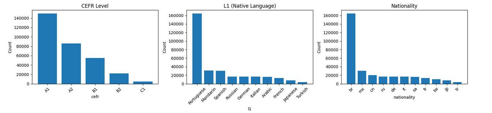

The corpus is heavily skewed at every level. CEFR is dominated by beginner essays — A1 alone accounts for ~47% of all samples. L1 and nationality are dominated by Portuguese/Brazilian learners at ~51%. This imbalance is addressed through class-weighted loss applied to all three heads, forcing the model to penalise minority-class errors more heavily during training.

### Word count by CEFR level

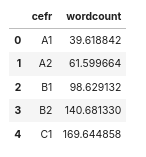

Average essay length scales almost linearly with CEFR level — from ~40 words at A1 to ~170 words at C1. This is a strong and expected signal: more proficient learners produce longer, more sustained writing. The model likely exploits this through the tokeniser's sequence length, meaning CEFR classification may partly be solved by essay length alone before any grammatical analysis. The planned raw-text-only ablation will help isolate how much is length vs. linguistic quality.

---

## Results

Trained for 3 epochs on an RTX 5060 (bf16 mixed precision, batch size 64, cosine LR schedule with warmup). Dataset: 317,220 essays split 80/20 (train/test, seed 42).

### Training curves

| Epoch | Train Loss | Val Loss |
|-------|-----------|----------|
| 1 | 3.0559 | 2.2516 |
| 2 | 1.8972 | 1.9192 |
| 3 | 1.4213 | 1.8728 |

Both losses decrease consistently across all three epochs — no divergence or overfitting observed within this run.

---

### CEFR classification — Accuracy: 98.1%

| Class | Precision | Recall | F1 | Support |
|-------|-----------|--------|----|---------|
| A1 | 0.99 | 0.99 | 0.99 | 29,896 |
| A2 | 0.99 | 0.98 | 0.98 | 17,189 |
| B1 | 0.98 | 0.96 | 0.97 | 10,928 |
| B2 | 0.93 | 0.96 | 0.94 | 4,443 |
| C1 | 0.88 | 0.95 | 0.91 | 988 |
| **weighted avg** | **0.98** | **0.98** | **0.98** | 63,444 |

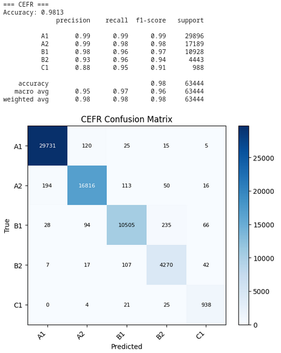

The confusion matrix tells a more nuanced story than the headline accuracy. Errors are almost entirely **adjacent-band** — B2 essays predicted as B1, C1 essays predicted as B2 — which mirrors how human raters also struggle at band boundaries. Notably, the model never predicts C1 as A1 or A1 as C1: extreme misclassification is essentially zero. The B1/B2 boundary (235 misclassifications each way) is the weakest point, consistent with the SLA literature where intermediate plateau learners are hardest to distinguish by surface error patterns alone. C1 recall of 95% from fewer than 1,000 test examples is the strongest indicator that class-weighted loss worked as intended.

---

### L1 identification — Accuracy: 69.7%

| Class | Precision | Recall | F1 | Support |
|-------|-----------|--------|----|---------|
| Arabic | 0.61 | 0.75 | 0.67 | 3,280 |
| French | 0.51 | 0.64 | 0.57 | 2,704 |
| German | 0.56 | 0.76 | 0.65 | 3,322 |
| Italian | 0.43 | 0.69 | 0.53 | 3,294 |
| Japanese | 0.53 | 0.76 | 0.62 | 1,596 |
| Mandarin | 0.77 | 0.81 | 0.79 | 6,333 |
| Portuguese | 0.95 | 0.66 | 0.78 | 32,671 |
| Russian | 0.55 | 0.74 | 0.63 | 3,383 |
| Spanish | 0.51 | 0.72 | 0.60 | 6,087 |
| Turkish | 0.34 | 0.64 | 0.45 | 774 |
| **macro avg** | **0.58** | **0.72** | **0.63** | 63,444 |

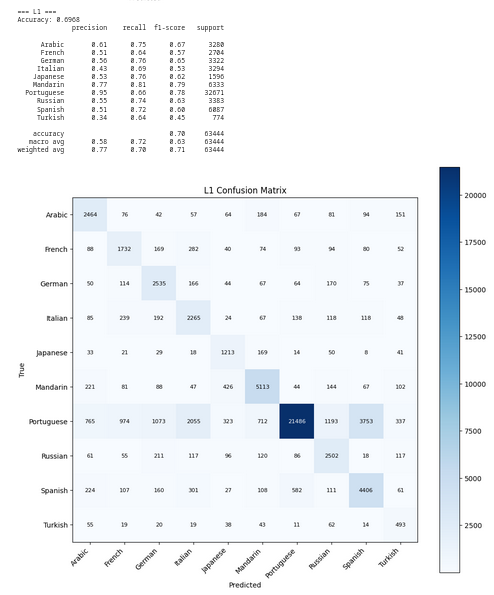

The L1 confusion matrix reveals linguistically meaningful error patterns. The largest off-diagonal confusions are between languages that share typological features or transfer error profiles: Italian and Spanish are frequently confused with each other and with Portuguese — all three are Romance languages whose speakers make similar determiner, copula, and preposition errors in English. Russian and Arabic show moderate confusion, both being non-Romance languages with no articles in their L1, leading to characteristic article-omission errors that may overlap in the model's feature space. Portuguese's high precision (0.95) but lower recall (0.66) reflects the class imbalance — the model is conservative about predicting Portuguese unless very confident. Turkish at macro F1 0.45 is the weakest class, unsurprisingly given its tiny support, but the 64% recall demonstrates the model has learned some signal from agglutinative transfer patterns.

---

### Nationality prediction — Accuracy: 68.2%

| Class | Precision | Recall | F1 | Support |
|-------|-----------|--------|----|---------|
| br | 0.95 | 0.65 | 0.78 | 32,671 |
| cn | 0.71 | 0.73 | 0.72 | 4,162 |
| de | 0.57 | 0.76 | 0.65 | 3,322 |
| fr | 0.50 | 0.64 | 0.56 | 2,704 |
| it | 0.42 | 0.69 | 0.52 | 3,294 |
| jp | 0.56 | 0.74 | 0.64 | 1,596 |
| mx | 0.51 | 0.72 | 0.60 | 6,087 |
| ru | 0.56 | 0.74 | 0.64 | 3,383 |
| sa | 0.62 | 0.74 | 0.67 | 3,280 |
| tr | 0.34 | 0.64 | 0.45 | 774 |
| tw | 0.45 | 0.61 | 0.52 | 2,171 |
| **macro avg** | **0.56** | **0.70** | **0.61** | 63,444 |

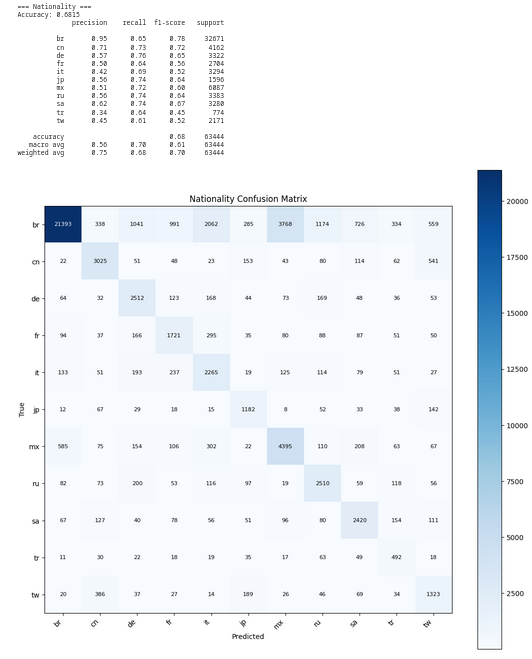

Nationality performance mirrors L1 closely — the two tasks are near-perfectly correlated in EFCAMDAT (br ≈ Portuguese, cn/tw ≈ Mandarin, de ≈ German). The tw/cn split is the most interesting case: Taiwanese (tw) and Mainland Chinese (cn) learners share the same L1 but are treated as separate nationality classes. The confusion between them (541 tw predicted as cn) is higher than any other cross-nationality confusion, which makes intuitive sense — the model has no genuine signal to distinguish them beyond subtle stylistic variation, since the underlying transfer patterns from Mandarin are the same.

---

### Latent embedding space (CLS vectors)

**t-SNE** (non-linear, preserves local structure):

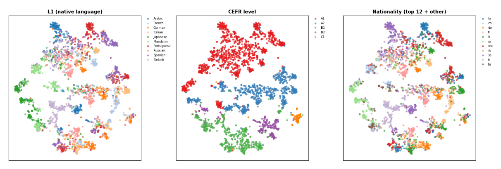

**PCA** (linear, preserves global variance):

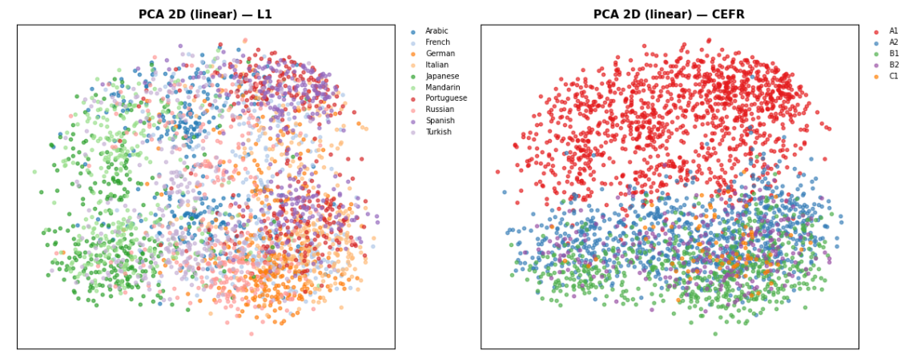

The embedding visualisations are among the most interpretable outputs of the project. **CEFR structure is strongly linear** — in the PCA plot, CEFR levels form a near-continuous gradient from top to bottom, confirming that the model has learned a meaningful proficiency axis in its representation space. The linearity is significant: it suggests proficiency is encoded as a genuine dimension in the encoder's geometry, not merely a lookup table. **L1 clusters are visible but overlapping** in t-SNE, with clear separation for Japanese and Mandarin but heavy overlap for the Romance languages — consistent with their shared typological features. The fact that L1 does not cleanly separate in PCA confirms the task requires non-linear features, which is why L1 accuracy is considerably harder than CEFR.

---

## SHAP — what the model learned

Token-level SHAP values were computed for five essays (one per CEFR band) across all three heads. Each bar chart shows the top 12 tokens by absolute SHAP value, split by the `[RAW]` and `[CORRECTED]` segments of the dual-text input. Red bars push the prediction *towards* the predicted class; blue bars push *away*.

Five plots were selected from the full output to illustrate the most interpretable and theoretically grounded findings.

---

### Finding 1 — Simple vocabulary drives low-level CEFR predictions

**Essay:** *"This Monday, there is going to be a play in Ibirapuera Park. The play starts at 9 am. Admission is free."* (true CEFR: A2)

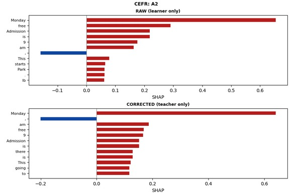

The top SHAP tokens for the A2 prediction are `Monday`, `free`, `Admission`, and `9` — high-frequency, concrete nouns and time expressions typical of simple, transactional writing. There are no complex subordinate clauses, no discourse connectors, and no low-frequency vocabulary. The model has correctly identified this as A2-level writing by attending to exactly the features a CELTA-trained assessor would note: functional, present-tense, topic-sentence-only structure with no elaboration.

---

### Finding 2 — Complex syntax and formal register drive C1 predictions

**Essay:** *"For ordinary citizen it was quite difficult to make out the benefits of the change..."* (true CEFR: C1)

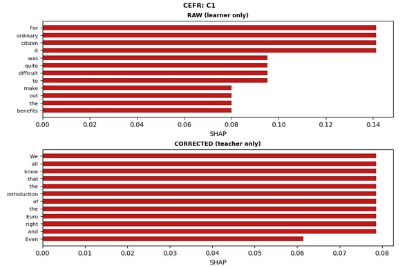

The C1 CEFR head attends to a qualitatively different set of tokens: `For ordinary citizen`, `it was quite difficult`, `to make out`, `the benefits`. These are markers of formal register, complex infinitival constructions, and idiomatic multi-word expressions — precisely the features that distinguish C1 from B2 in the CEFR descriptors. Notably the model attends to the *phrase* rather than individual words, reflecting that RoBERTa's contextual embeddings capture syntactic structure rather than isolated token frequency.

---

### Finding 3 — Named entities as geographic L1 cues

**Essay:** *"This Monday, there is going to be a play in Ibirapuera Park."* (true L1: Portuguese)

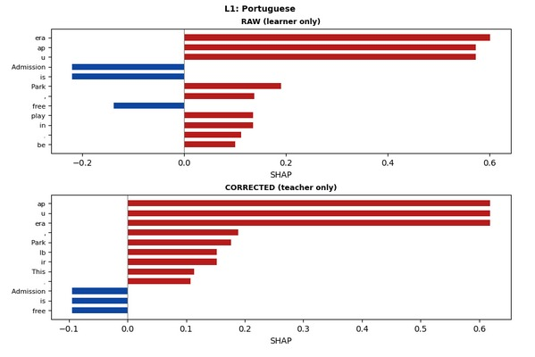

The most prominent tokens for the Portuguese L1 prediction are `era`, `ap`, and `u` — subword fragments of the tokenised place name *Ibirapuera*. The model has learnt that this São Paulo park name is a strong indicator of Brazilian Portuguese L1 background. This is a form of **named-entity anchoring** rather than grammatical error detection, and raises an important methodological question: is the model detecting L1 transfer patterns, or exploiting topical and geographic references that happen to be culturally specific? In this essay, where the raw and corrected texts are identical (no errors to detect), the model falls back on named-entity signal entirely.

---

### Finding 4 — The dual-text signal: RAW and CORRECTED carry opposite information for L1

**Essay:** *"The French like to honour their good food with good presentation and good manners..."* (true L1: French)

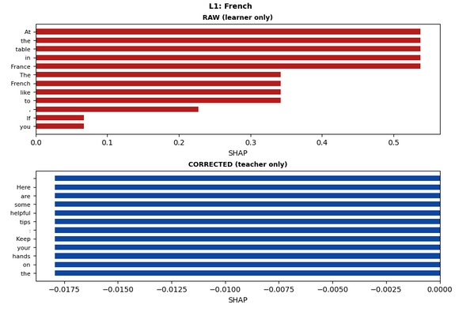

This is the most theoretically revealing SHAP result in the dataset. The `[RAW]` panel shows strongly positive (red) contributions from `At`, `the`, `table`, `in`, `France`, `The`, `French` — the essay explicitly names French culture and dining customs, giving the model an unambiguous topical signal. The `[CORRECTED]` panel, however, is entirely **blue** — every token in the corrected text pushes *away* from the French L1 prediction. The teacher's corrections have apparently neutralised or normalised the surface features the model relied on in the raw text. This directly confirms a key concern raised in the dataset analysis: for L1 identification, the model is partially exploiting **cultural content and named entities** in the raw text rather than purely linguistic transfer patterns. A raw-text-only ablation is necessary to quantify this effect.

---

### Finding 5 — Transfer errors and cultural markers combine for German L1

**Essay:** *"The Euro is approximately ten years old... Even today the German citizen do not have a lot of confidence..."* (true L1: German)

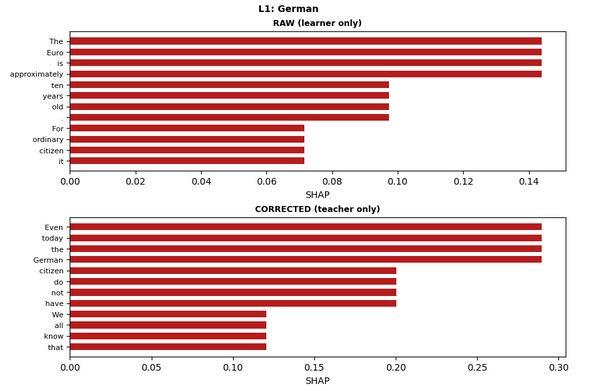

The German L1 head attends to two distinct signal types simultaneously. In the `[RAW]` panel, `The Euro is approximately ten years old` drives the prediction — topic-level content about the Eurozone, a subject with obvious cultural relevance to German speakers. In the `[CORRECTED]` panel, the phrase `Even today the German citizen do not have` carries the highest SHAP weight. This sentence contains a genuine L1 transfer error: `citizen` should be `citizens` (number agreement), and the construction `the German citizen do not have` reflects a German grammatical pattern where collective nouns can remain singular. The model is attending to both the explicit cultural reference (`German citizen`) and the underlying transfer error simultaneously — the ideal combination of signals for reliable L1 identification.

---

### Summary of SHAP findings

| Head | Primary signal | Secondary signal |
|------|---------------|-----------------|
| CEFR | Vocabulary complexity, syntactic structure | Essay length (via truncation) |
| L1 | Named entities and cultural references in RAW | Transfer errors in CORRECTED |
| Nationality | Near-identical to L1 (correlated tasks) | — |

The most important implication for future work is the **RAW/CORRECTED asymmetry** in the L1 head: the two input segments are not providing complementary linguistic signals as intended — they are providing competing signals with opposite polarity for content-rich essays. This suggests that separating the two segments with learnt attention weights, rather than simple concatenation, may be a more principled architectural choice.


---

## Project structure

```
efcamdat-multitask-learner-profiling/
├── Cambridge_Models_final.ipynb   # Main notebook (13 cells: train, eval, SHAP)
├── images/                        # All evaluation plots and SHAP visualisations
├── requirements.txt
└── README.md
```

---

## Requirements

```
transformers>=4.40
datasets
torch>=2.0
scikit-learn
shap
pandas
tqdm
matplotlib
```

Install with:

```bash
pip install -r requirements.txt
```

---

## Usage

### 1. Prepare data

| Column | Description |
|--------|-------------|
| `text` | Raw learner essay |
| `text_corrected` | Teacher-corrected version |
| `cefr` | CEFR label string (A1, A2, …) |
| `l1` | Native language string |
| `nationality` | Nationality code |

### 2. Run the notebook

Works on Colab (mount Drive, set `DATA_DIR`) or locally (place CSV in the same folder as the notebook). GPU recommended — training on an RTX 5060 takes ~50 minutes per epoch at batch size 64 with bf16.

### 3. Inference on a new essay

```python
essay_text     = "I have 24 years and I work in a company."
corrected_text = "I am 24 years old and I work for a company."

inputs = tokenizer(
    ["[RAW] " + essay_text + " [CORRECTED] " + corrected_text],
    truncation=True, padding='max_length', max_length=128, return_tensors='pt'
)

multitask_model.eval()
with torch.no_grad():
    outputs = multitask_model(**{k: v.to(device) for k, v in inputs.items()})

print(cefr_encoder.inverse_transform([outputs['cefr'].argmax().item()]))
print(l1_encoder.inverse_transform([outputs['l1'].argmax().item()]))
print(nat_encoder.inverse_transform([outputs['nat'].argmax().item()]))
```

### 4. Explain a prediction with SHAP

```python
explainer = shap.Explainer(make_shap_predictor(multitask_model, 'cefr', device), tokenizer)
shap_values = explainer(["[RAW] I have 24 years [CORRECTED] I am 24 years old"])
shap.plots.text(shap_values[0])
```

---

## Planned work

- Topic-controlled SHAP analysis on essays with neutral subject matter to isolate genuine transfer error signal from topical content leakage
- Raw-text-only ablation to quantify the dual-text contribution to CEFR accuracy
- Balanced undersample run (capped per-class) for direct comparison against this baseline
- Extend to 5 epochs with early stopping now that 3-epoch loss curves confirm stable training
- Wrap in a FastAPI + React app: upload essay → predictions + SHAP highlight
- Cross-corpus evaluation on CasiMedicos or NUCLE to test generalisability

---

## Author

Darragh — MSc Language Analysis and Processing, UPV/EHU | CELTA-certified ELT practitioner  
[GitHub: VerbalAid](https://github.com/VerbalAid)
